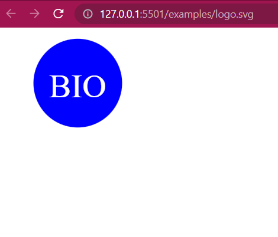

# SVG Logo Maker
This is a simple SVG Logo Maker application built using Node.js. With this application, you can generate a logo consisting of up to three characters, choosing the text color, shape, and the color.

## Installation
1. Clone this repository
2. Run `npm install` to install the dependencies
3. Run `npm start` to start the application

## Usage
1. Open a terminal or command prompt and navigate to the project's directory.
2. Run the following command to start the application: node index.js
3. The application will prompt you to enter the text, shape and color of the text and shape.
4. The application will generate the logo and save it in the `examples` directory.

## License
This project is licensed under the MIT License - see the [LICENSE](LICENSE) file for details

## Credits
This application was developed using Node.js and various open-source libraries. Special thanks to the developers of these libraries for their contributions.

* Node.js: https://nodejs.org
* SVG.js: https://svgjs.com
* Inquirer.js: https://github.com/SBoudrias/Inquirer.js
* color-name: https://github.com/colorjs/color-name

If you have any questions or need further assistance, please feel free to reach out.

Happy logo making!

## Link to walkthrough video 
[Link walkthrough video](https://watch.screencastify.com/v/EVAFO2Z26jDI2CYrqNfA)  

## Screenshot of a logo.svg sample generated using the application
